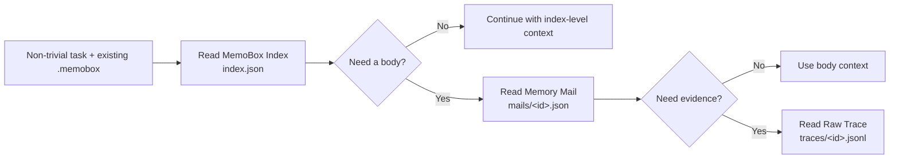

<div align="center">

# MemoBox

**A model-readable local memory file protocol for AI agents.**

Give models a local-first memory file protocol they can inspect with Bash: `index.json` first, then body and evidence files only when they choose. The CLI only writes and maintains consistency.

[中文](README.md) · [Schema](docs/schema.md) · [Dogfooding](docs/dogfooding.md) · [Example](examples/demo.py) · [GitHub](https://github.com/study8677/memobox)

[](https://github.com/study8677/memobox/actions/workflows/ci.yml)
[](pyproject.toml)
[](LICENSE)
[](CHANGELOG.md)

<br/>


</div>

---

## What Is MemoBox

MemoBox is a **model-readable local memory file protocol**. It stores useful work records as structured memory mail and exposes three layers: lightweight index, expandable body, and raw evidence.

It targets a common long-term memory problem for engineering models:

> We do not lack history. We lack a model-readable, auditable surface that can be expanded on demand.

MemoBox keeps the boundary simple:

```text
MemoBox defines local files -> the model reads them directly with Bash -> the CLI only writes and maintains consistency
```

## Why Mailbox

The mailbox model is not decorative. It is the core interaction model:

- **The subject is the best summary**: email subjects are short, explicit, and scannable; `MemoryMail.subject` is the model-friendly first layer.
- **The inbox is the lightweight index**: `index.json` is a scannable directory, but MemoBox does not decide relevance.
- **The body is progressive disclosure**: if the model needs more context, it can read the selected `mails/<id>.json` body.
- **Attachments and originals are evidence**: `traces/<id>.jsonl` opens only when evidence is needed.
- **Status is memory lifecycle**: `pinned`, `archived`, `stale`, and `needs_review` map to inbox-style memory management.

This matches how models use Bash and tools: the file layer exposes a clear structure, and the model decides when to read, which ids to read, and how deep to go.

MemoBox turns long model-visible history into progressive disclosure:

```text
subject -> summary -> memory body -> raw evidence
```

The first version focuses on five promises:

- **Opt-in agent loop**: an existing `.memobox` enables the project loop; non-trivial work reads the index first and writes only high-value outcomes at the end.
- **Index-first**: expose the `index.json` directory before full bodies and evidence.
- **Memory mail**: store decisions, artifacts, risks, and next actions as structured memory records.
- **Evidence-aware**: open `Memory Mail` or `Raw Trace` only when more evidence is needed.
- **Local-first Python**: zero runtime dependencies, file protocol + write/maintenance CLI + Python API, auditable JSON files.

## 30-Second Demo

```bash
memobox --store .memobox write \
  --subject "Fix slow /orders API" \
  --summary "Found N+1 query pattern and added eager loading." \
  --project api-platform \
  --team backend \
  --role model \
  --tags performance,n-plus-one \
  --body "Changed OrderService query path and added regression test." \
  --decision "Prefer query-level fix before introducing cache."

cat .memobox/index.json
```

The first layer a model can read is not full history, but a compact directory entry:

```json
{
  "subject": "Fix slow /orders API",
  "summary": "Found N+1 query pattern and added eager loading.",
  "project": "api-platform",
  "tags": ["performance", "n-plus-one"],
  "status": "inbox"
}
```

MemoBox does not decide relevance. The model decides whether to open the matching body file or raw trace file.

## Not Another Vector Memory Store

| Common memory systems | MemoBox |
| --- | --- |
| User preferences, facts, semantic fragments | Work records, decisions, evidence, next actions |
| Often embedding-first | Directory-first by default, explainable and auditable |
| Source chains can be unclear | Summary -> body -> raw trace |
| Great for personal assistant preferences | Great for engineering models and tool-driven sessions |
| More history can become more black-box | Auditable index, pin, archive, mark stale |

MemoBox can work with mem0, RAG, Obsidian, and logs. mem0 is better for user preferences and factual memory; MemoBox is better for model-readable work records.

## Features

| Feature | What it means |
| --- | --- |
| File protocol first | Models directly read `index.json`, `mails/*.json`, and `traces/*.jsonl` |
| Memory mail | Important work records become expandable memory records |
| Raw trace on demand | Conversation/tool/terminal evidence opens only when requested |
| Team-ready metadata | Built-in `project`, `workspace`, `team`, `role`, `participants` |
| Memory maintenance | `pinned`, `needs_review`, `archived`, `stale` |
| Maintenance CLI | Pure Python CLI for writes, status sync, promotion, merging, verification, and index rebuilds |

## Architecture



| Layer | File | Contents |
| --- | --- | --- |
| MemoBox Index | `index.json` | subject, summary, project, team, role, tags, status, timestamps |
| Memory Mail | `mails/<id>.json` | context, decisions, artifacts, risks, next actions, source refs |
| Raw Trace | `traces/<id>.jsonl` | conversation turns, tool calls, terminal evidence, external events |

The test suite verifies `index.json` stores only index-level data and does not mix in mail bodies or raw traces.

## Quick Start

Prefer an isolated user-level tool installation:

```bash
uv tool install "git+https://github.com/study8677/memobox.git"

# Or
pipx install "git+https://github.com/study8677/memobox.git"

memobox --help
```

Initialize:

```bash
memobox --store .memobox init
```

Add memory:

```bash
memobox --store .memobox write \
  --subject "MemoBox index-first storage" \
  --summary "Models can read the lightweight index before opening memory bodies." \
  --project memobox \
  --team platform \
  --role model \
  --tags memory,storage,index-first \
  --body "Implemented index/body/raw-trace split and tests for lazy expansion." \
  --decision "Directory reads must never open raw traces by default."
```

Read the memory index directly:

```bash
cat .memobox/index.json
```

Read a body by id:

```bash
cat .memobox/mails/<memory-id>.json
```

Read raw trace by id:

```bash
cat .memobox/traces/<memory-id>.jsonl
```

## Agent Use Loop

An existing `.memobox` directory is the project's opt-in signal. Installing the CLI or plugin does not create stores across every repository. If the directory is missing, the agent continues normally and runs `memobox --store .memobox init` only after the user explicitly opts in.

In an opted-in project, the agent follows this loop:

1. Skip simple lookups, formatting, and one-off mechanical work. Also skip security-restricted or sensitive tasks unless the user explicitly authorizes safe, redacted persistence.
2. At the start of non-trivial work, read `.memobox/index.json`. The model then uses subjects, summaries, tags, status, and timestamps to choose whether to open specific bodies. MemoBox does not rank, filter, or decide relevance.
3. Read `traces/<id>.jsonl` only when evidence is required. Track opened ids separately from reused ids; a memory is reused only when it materially affects the plan, decision, implementation, or verification.
4. At task end, apply a strict worthiness gate. Save only durable decisions, non-obvious verified causes and fixes, reusable exact evidence, important risks, or cross-session handoffs. Most tasks should write zero or one record.
5. If a new Memory Mail reused older memories, add `--source-ref "memobox:<id>"` for every materially reused id. Never create a low-value record merely to log reuse.

```bash
memobox --store .memobox write \
  --subject "Fix concurrent index writes" \
  --summary "Added locking and atomic replacement after reproducing lost index entries." \
  --project memobox \
  --body "Verified the failure with a concurrent write reproduction and the fix with regression tests." \
  --decision "Treat mail bodies as durable records and keep index updates consistent." \
  --artifact "file:src/memobox/store.py" \
  --source-ref "memobox:<reused-memory-id>" \
  --json
```

See [docs/dogfooding.md](docs/dogfooding.md) for the two-week process, run-log fields, metric definitions, and acceptance gates.

## Python API

```python
from memobox import JsonMemoBoxStore, MemoryMail

store = JsonMemoBoxStore(".memobox")

store.add_mail(
    MemoryMail(
        id="",
        subject="Memory storage design",
        summary="MemoBox stores model-readable memory as index-first mail records.",
        project="memobox",
        team="platform",
        role="model",
        tags=["memory-store", "index-first"],
        context="Longer expandable body lives outside the index.",
        decisions=["Expose storage structure and let the model decide what to read."],
    )
)

directory = store.list_index()
mail = store.open_mail(directory[0].id)
```

## File Protocol And CLI

MemoBox exposes a local file protocol, not an orchestration layer. A model with Bash/tool access should read JSON files directly; the CLI is only for operations that modify multiple files or need consistency.

| File/command | Purpose |
| --- | --- |
| `.memobox/index.json` | Lightweight memory directory for first-pass scanning |
| `.memobox/mails/<id>.json` | One Memory Mail body |
| `.memobox/traces/<id>.jsonl` | Optional raw trace evidence |
| `memobox write` | Write one Memory Mail and sync index/body/trace |
| `memobox status <id> <status>` | Sync status in both body and index |
| `memobox promote <id>` | Copy reusable memory into a global store |
| `memobox curate duplicates` | Find likely duplicate memories |
| `memobox curate merge ...` | Merge memories and archive sources |
| `memobox verify` | Read-only cross-file integrity check for bodies, index, and traces |
| `memobox rebuild-index` | Atomically rebuild the derived index from valid `mails/*.json` truth |

Recommended project/global layout:

```text
your-project/.memobox        # current project memory
~/.memobox-global            # reusable cross-project memory
```

You can also set the global store with an environment variable:

```bash
export MEMOBOX_GLOBAL_STORE="$HOME/.memobox-global"
```

Read the current project index directly:

```bash
cat .memobox/index.json
```

Read project and global indexes directly:

```bash
cat .memobox/index.json
cat ~/.memobox-global/index.json
```

Write one memory:

```bash
memobox --store .memobox write \
  --subject "Improve MemoBox README positioning" \
  --summary "Reframed MemoBox as a model-readable memory file protocol instead of orchestration." \
  --project memobox \
  --team platform \
  --role model \
  --tags readme,storage,open-source \
  --body "The public surface now leads with local files for reads and CLI for writes." \
  --decision "Keep MemoBox out of relevance ranking and orchestration."
```

The Python API keeps the same boundary:

```python
from pathlib import Path


def list_memobox_index() -> str:
    return Path(".memobox/index.json").read_text(encoding="utf-8")


def open_memory_mail(memory_id: str) -> str:
    return Path(f".memobox/mails/{memory_id}.json").read_text(encoding="utf-8")


def open_raw_trace(memory_id: str) -> str:
    return Path(f".memobox/traces/{memory_id}.jsonl").read_text(encoding="utf-8")
```

Promote reusable project memory:

```bash
memobox --store .memobox promote <memory-id> \
  --global-store ~/.memobox-global \
  --tag readme-pattern
```

Curate memory:

```bash
memobox --store .memobox curate duplicates --json
memobox --store .memobox curate merge <id-a> <id-b> \
  --subject "Merged README homepage guidance" \
  --summary "Merged duplicate README optimization memories."
memobox --store .memobox status <id> stale
memobox --store .memobox status <id> pinned
```

## Claude Code / Codex Plugin

The first MemoBox plugin is a **skills-only plugin**. It does not start an MCP server. Reads use the `.memobox` file protocol; writes and maintenance use the `memobox` CLI.

Install the CLI first:

```bash
uv tool install "git+https://github.com/study8677/memobox.git"

# Or
pipx install "git+https://github.com/study8677/memobox.git"
```

Install in Claude Code:

```bash
claude plugin marketplace add study8677/memobox
claude plugin install memobox@memobox-marketplace --scope user
```

Install in Codex:

```bash
codex plugin marketplace add study8677/memobox
codex plugin add memobox@memobox-marketplace
```

After installation, use natural language:

```text
Use MemoBox to inspect this project's memory files.
Use MemoBox to write one memory.
Use MemoBox to curate duplicate memories.
```

Or invoke skills explicitly:

```text
Claude Code: /memobox:using-memobox
Codex: $using-memobox
```

Defaults:

- Opt-in signal: `.memobox` already exists in the current repository; the plugin does not initialize every project
- Project memory: `.memobox` in the current repository
- Global memory: `${MEMOBOX_GLOBAL_STORE:-$HOME/.memobox-global}`
- Start of non-trivial work: read `index.json` first, then let the model choose bodies and evidence
- Task end: write structured results with `memobox write` only after the worthiness gate; record materially reused ids in `source_refs`
- Simple, sensitive, or non-durable tasks: do not read or write MemoBox
- Maintenance: use `memobox status/promote/curate/verify/rebuild-index`

Before Codex automatically compacts context, the plugin can write a checkpoint memory through a `PreCompact(auto)` hook. This is only a loss-prevention safety net and does not replace a deliberate, high-quality end-of-task write:

- It writes only when the current repository already has `.memobox`, so installing the plugin does not create memory stores everywhere.
- The checkpoint is marked `needs_review` and tagged with `codex`, `precompact`, `context`, and `checkpoint`.
- By default the record keeps only selected hook metadata, the current working directory, and git status; it does not persist the full payload. Set `MEMOBOX_PRECOMPACT_INCLUDE_PAYLOAD=1` only to explicitly retain the basically redacted payload. Even then, MemoBox does not claim to receive the complete transcript.
- For sensitive or security-restricted work, set `MEMOBOX_PRECOMPACT_DISABLED=1` to skip automatic checkpoints for the session.
- Set `MEMOBOX_PRECOMPACT_INIT=1` if you want the hook to initialize a missing store automatically.

## Who It Is For

- Coding models that need project decisions, paths, failures, and fixes.
- Ops models that need incident notes, command evidence, and rollback steps.
- Research models that need claims, sources, and open hypotheses.
- Multi-tool collaboration that shares structured work records instead of chat transcripts.
- Knowledge-base users turning conversation history into maintainable work records.

## Roadmap

**Storage**

- [x] Local JSON store
- [x] Cross-process write lock, atomic replacement, and rebuildable derived index
- [ ] SQLite backend
- [ ] Schema migration

**Storage Interface**

- [x] Index-first local file protocol
- [x] Maintenance CLI: `write`, `status`, `promote`, `curate`, `verify`, `rebuild-index`
- [ ] Better index organization and lifecycle views

**Model Integration**

- [x] CLI: `init`, `write`, `status`, `promote`, `curate`
- [x] Claude Code / Codex skills-only plugin
- [x] Codex `PreCompact(auto)` checkpoint hook
- [x] `.memobox` opt-in + index-first + high-value write agent loop
- [ ] Dogfood 20 real tasks across three active projects
- [ ] MCP server for Codex, Claude Desktop, Cursor

**UX / Trust**

- [x] Chinese and English README files
- [ ] Privacy redaction hooks
- [ ] Web UI for inbox-style model-readable memory
- [ ] Social preview and visual identity

## Development

```bash
python3 -m venv .venv
source .venv/bin/activate
python3 -m pip install -e ".[test]"
python3 -m pytest -q
PYTHONPATH=src python3 examples/demo.py
```

## What Is Tested

MemoBox's core promise is the index-first file protocol, so tests verify both write behavior and read paths:

- `index.json` does not contain `context`, `decisions`, or raw trace contents.
- `mails/<id>.json` contains the Memory Mail body.
- `traces/<id>.jsonl` contains Raw Trace evidence.
- The CLI no longer wraps read commands.
- Concurrent subprocess writes preserve every index entry, and a damaged index can be rebuilt safely from valid mail bodies.

## Contributing

MemoBox is alpha-stage. Good contribution areas:

- Model-readable memory evaluation datasets.
- mem0 / MCP / Obsidian integrations.
- Better index organization, stale-memory, and archive policies.
- Team permission and audit models.
- Web UI and social preview design.

See [CONTRIBUTING.md](CONTRIBUTING.md).

## License

MIT License. See [LICENSE](LICENSE).
