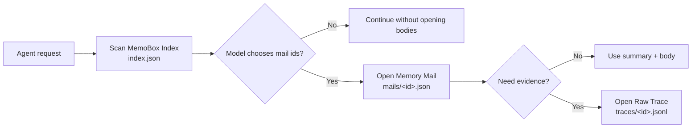

<div align="center">

# MemoBox

**An inbox-style memory layer for AI agents.**

Let agents scan memory subjects first, then open bodies and evidence on demand, instead of stuffing full conversation history into context.

[中文](README.md) · [Schema](docs/schema.md) · [Example](examples/demo.py) · [GitHub](https://github.com/study8677/memobox)

[](https://github.com/study8677/memobox/actions/workflows/ci.yml)
[](pyproject.toml)
[](LICENSE)
[](CHANGELOG.md)

<br/>


</div>

---

## What Is MemoBox

MemoBox is a **task-level memory box** for AI agents. It stores each finished task as a structured memory mail, so the next agent run can scan a lightweight index first and expand the body or raw evidence only when needed.

It targets a common long-term memory problem for engineering agents:

> We do not lack history. We lack a reliable way for agents to decide which history is worth opening.

MemoBox follows a simple default policy:

```text
open the index.json directory -> let the model choose mail ids -> open mails/<id>.json -> open traces/<id>.jsonl only for evidence
```

## Why Mailbox

The mailbox model is not decorative. It is the core interaction model:

- **The subject is the best summary**: email subjects are short, explicit, and scannable; `MemoryMail.subject` is the first memory layer an agent should read.
- **The inbox is the lightweight index**: the agent scans `index.json` the way a human scans an inbox.
- **The body is progressive disclosure**: the agent scans the full directory first, then chooses which `mails/<id>.json` bodies to open.
- **Attachments and originals are evidence**: `traces/<id>.jsonl` opens only when the agent needs proof.
- **Status is memory lifecycle**: `pinned`, `archived`, `stale`, and `needs_review` map to inbox-style memory management.

This matches how agent skills should load context: do not load all history first; scan the title layer, then let the model choose which mail to expand.

MemoBox turns long agent history into progressive disclosure:

```text
subject -> summary -> memory body -> raw evidence
```

The first version focuses on four promises:

- **Index-first**: open the `index.json` directory by default instead of loading full bodies and evidence into context.
- **Task-level memory**: store decisions, artifacts, risks, and next actions per completed task.
- **Evidence-aware**: open `Memory Mail` or `Raw Trace` only when more evidence is needed.
- **Local-first Python**: zero runtime dependencies, CLI + Python API, auditable JSON files.

## 30-Second Demo

```bash
memobox --store .memobox add \
  --subject "Fix slow /orders API" \
  --summary "Found N+1 query pattern and added eager loading." \
  --project api-platform \
  --team backend \
  --role coding-agent \
  --tags performance,n-plus-one \
  --body "Changed OrderService query path and added regression test." \
  --decision "Prefer query-level fix before introducing cache."

memobox --store .memobox inbox --json
```

The first layer an agent sees is not full history, but a compact directory entry:

```json
{
  "subject": "Fix slow /orders API",
  "summary": "Found N+1 query pattern and added eager loading.",
  "project": "api-platform",
  "tags": ["performance", "n-plus-one"],
  "status": "inbox"
}
```

MemoBox does not decide relevance. The model reads the directory and chooses which body or raw trace to open.

## Not Another Vector Memory Store

| Common memory systems | MemoBox |
| --- | --- |
| User preferences, facts, semantic fragments | Tasks, decisions, evidence, next actions |
| Often embedding-first | Directory-first by default, explainable and auditable |
| Source chains can be unclear | Summary -> body -> raw trace |
| Great for personal assistant preferences | Great for engineering agents and multi-agent teams |
| More history can become more black-box | Inbox workflow: pin, archive, mark stale |

MemoBox can work with mem0, RAG, Obsidian, and logs. mem0 is better for user preferences and factual memory; MemoBox is better for task-level work records.

## Features

| Feature | What it means |
| --- | --- |
| Index-first inbox | `inbox` / `recall` list the `index.json` directory by default |
| Task memory mail | Each task becomes an expandable memory record |
| Raw trace on demand | Conversation/tool/terminal evidence opens only when requested |
| Team-ready metadata | Built-in `project`, `workspace`, `team`, `role`, `participants` |
| Inbox workflow | `inbox`, `pinned`, `needs_review`, `archived`, `stale` |
| Local-first CLI | Pure Python and JSON files, easy to wire into agents |

## Architecture



| Layer | File | Contents |
| --- | --- | --- |
| MemoBox Index | `index.json` | subject, summary, project, team, role, tags, status, timestamps |
| Memory Mail | `mails/<id>.json` | context, decisions, artifacts, risks, next actions, source refs |
| Raw Trace | `traces/<id>.jsonl` | conversation turns, tool calls, terminal evidence, external events |

The test suite verifies directory reads return only index-level data and do not open mail bodies or raw traces.

## Quick Start

```bash
git clone https://github.com/study8677/memobox.git
cd memobox
python3 -m pip install -e ".[test]"
```

Initialize:

```bash
memobox --store .memobox init
```

Add memory:

```bash
memobox --store .memobox add \
  --subject "MemoBox index-first retrieval" \
  --summary "Agent should scan the lightweight index before opening memory bodies." \
  --project memobox \
  --team platform \
  --role main-agent \
  --tags memory,agent,index-first \
  --body "Implemented index/body/raw-trace split and tests for lazy expansion." \
  --decision "Directory reads must never open raw traces by default."
```

Open the inbox directory:

```bash
memobox --store .memobox inbox --json
```

Open body:

```bash
memobox --store .memobox show <memory-id> --json
```

Open raw trace:

```bash
memobox --store .memobox raw <memory-id> --json
```

## Python API

```python
from memobox import JsonMemoBoxStore, MemoryMail

store = JsonMemoBoxStore(".memobox")

store.add_mail(
    MemoryMail(
        id="",
        subject="Agent memory design",
        summary="MemoBox stores task-level memory as index-first mail records.",
        project="memobox",
        team="platform",
        role="main-agent",
        tags=["agent-memory", "index-first"],
        context="Longer expandable body lives outside the index.",
        decisions=["Use task-level memory instead of turn-level memory for v1."],
    )
)

directory = store.list_index()
mail = store.open_mail(directory[0].id)
```

## Agent Integration

Expose three basic tools to your agent:

```python
def list_memobox_inbox() -> str:
    entries = store.list_index()
    return "\n".join(f"{entry.id}: {entry.subject} - {entry.summary}" for entry in entries)


def open_memory_mail(memory_id: str) -> str:
    mail = store.open_mail(memory_id)
    return mail.context


def open_raw_trace(memory_id: str) -> list[dict]:
    return store.open_raw_trace(memory_id)
```

Recommended policy:

- Call `list_memobox_inbox` at task startup.
- Let the model scan subjects, summaries, tags, status, and timestamps.
- Call `open_memory_mail` only after the model chooses specific ids.
- Open raw trace only when evidence is needed.
- At task completion, let the main agent or a memory curator agent write a new Memory Mail.

## Agent Workflow

MemoBox now provides these lifecycle commands for agents:

| Command | Trigger | Purpose |
| --- | --- | --- |
| `memobox inbox` / `memobox map` | Task start | Open the current project index directory with body and evidence locations |
| `memobox recall` | Task start | Open project and global memory directories so the model can choose bodies |
| `memobox remember` | Task end | Write a standard Memory Mail for the completed task |
| `memobox promote` | Reusable learning | Promote project memory into global memory |
| `memobox curate` | Memory maintenance | Find duplicates, merge, mark stale, and pin important memories |

Recommended project/global layout:

```text
your-project/.memobox        # current project memory
~/.memobox-global            # reusable cross-project memory
```

You can also set the global store with an environment variable:

```bash
export MEMOBOX_GLOBAL_STORE="$HOME/.memobox-global"
```

Open directories at task start:

```bash
memobox --store .memobox recall \
  "high-star README homepage structure" \
  --project memobox \
  --global-store ~/.memobox-global \
  --json
```

Remember at task completion:

```bash
memobox --store .memobox remember \
  --subject "Improve MemoBox README homepage" \
  --summary "Reworked README into a high-star style homepage with hero, demo, differentiation, workflow, and roadmap." \
  --project memobox \
  --team platform \
  --role memory-curator \
  --tags readme,github,open-source \
  --body "The README now leads with index-first task memory, then shows a 30-second demo and agent workflow." \
  --decision "Keep README.md Chinese-first and README-EN.md as the English version."
```

Promote reusable project memory:

```bash
memobox --store .memobox promote <memory-id> \
  --global-store ~/.memobox-global \
  --tag readme-pattern
```

Curate memory:

```bash
memobox --store .memobox curate duplicates --json
memobox --store .memobox curate merge <id-a> <id-b> \
  --subject "Merged README homepage guidance" \
  --summary "Merged duplicate README optimization memories."
memobox --store .memobox curate stale <id>
memobox --store .memobox curate pin <id>
```

## Claude Code / Codex Plugin

The first MemoBox plugin is a **skills-only plugin**. It does not start an MCP server or change CLI arguments. It teaches Claude Code and Codex when to call the existing `memobox` command.

Install the CLI first:

```bash
python3 -m pip install --user git+https://github.com/study8677/memobox.git
```

Install in Claude Code:

```bash
claude plugin marketplace add study8677/memobox
claude plugin install memobox@memobox-marketplace --scope user
```

Install in Codex:

```bash
codex plugin marketplace add study8677/memobox
codex plugin add memobox@memobox-marketplace
```

After installation, use natural language:

```text
Use MemoBox to open this project's memory inbox.
Use MemoBox to remember this task outcome.
Use MemoBox to curate duplicate memories.
```

Or invoke skills explicitly:

```text
Claude Code: /memobox:recall
Claude Code: /memobox:remember
Codex: $memobox:recall
Codex: $memobox:remember
```

Defaults:

- Project memory: `.memobox` in the current repository
- Global memory: `${MEMOBOX_GLOBAL_STORE:-$HOME/.memobox-global}`
- Recall opens the index directory first; the model chooses which bodies to open; raw traces open only when evidence is needed.

## Who It Is For

- Coding agents that need project decisions, paths, failures, and fixes.
- Ops agents that need incident notes, command evidence, and rollback steps.
- Research agents that need claims, sources, and open hypotheses.
- Multi-agent teams sharing task-level context instead of chat transcripts.
- Knowledge-base users turning conversation history into maintainable work records.

## Roadmap

**Storage**

- [x] Local JSON store
- [ ] SQLite backend
- [ ] Schema migration

**Directory Workflow**

- [x] Index-first inbox/map directory
- [x] Legacy lexical search command
- [ ] Better inbox organization and lifecycle views

**Agent Integration**

- [x] CLI: `init`, `add`, `inbox`, `map`, `recall`, `search`, `show`, `status`, `raw`
- [x] Claude Code / Codex skills-only plugin
- [ ] Memory curator agent workflow
- [ ] MCP server for Codex, Claude Desktop, Cursor

**UX / Trust**

- [x] Chinese and English README files
- [ ] Privacy redaction hooks
- [ ] Web UI for inbox-style agent memory
- [ ] Social preview and visual identity

## Development

```bash
python3 -m pip install -e ".[test]"
python3 -m pytest -q
PYTHONPATH=src python3 examples/demo.py
```

## What Is Tested

MemoBox's core promise is index-first directory review, so tests verify both output and read path:

- `inbox` / `recall` call `list_index()` only.
- Directory output does not include `context`, `decisions`, or raw trace contents.
- `show` expands `Memory Mail`.
- `raw` or explicit flags open `Raw Trace`.

## Contributing

MemoBox is alpha-stage. Good contribution areas:

- Agent memory evaluation datasets.
- mem0 / MCP / Obsidian integrations.
- Better inbox organization, stale-memory, and archive policies.
- Team permission and audit models.
- Web UI and social preview design.

See [CONTRIBUTING.md](CONTRIBUTING.md).

## License

MIT License. See [LICENSE](LICENSE).
