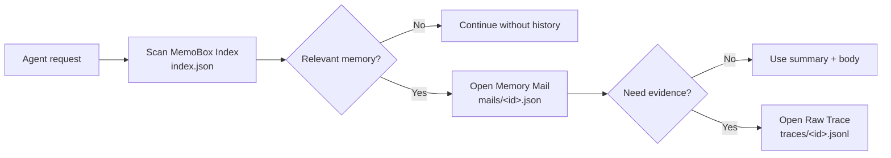

<div align="center">

# MemoBox

**Index-first task memory for AI agents.**

Let agents read long-term memory like an inbox, instead of stuffing full conversation history into context.

[中文](README.md) · [Schema](docs/schema.md) · [Example](examples/demo.py) · [GitHub](https://github.com/study8677/memobox)

[](https://github.com/study8677/memobox/actions/workflows/ci.yml)
[](pyproject.toml)
[](LICENSE)
[](CHANGELOG.md)

</div>

---

## What Is MemoBox

MemoBox is a **task-level memory box** for AI agents. It stores each finished task as a structured memory mail, so the next agent run can scan a lightweight index first and expand the body or raw evidence only when needed.

It targets a common long-term memory problem for engineering agents:

> We do not lack history. We lack a reliable way for agents to decide which history is worth opening.

MemoBox follows a simple default policy:

```text
scan index.json -> open mails/<id>.json on match -> open traces/<id>.jsonl only for evidence
```

The first version focuses on four promises:

- **Index-first**: search `index.json` by default instead of loading full history into context.
- **Task-level memory**: store decisions, artifacts, risks, and next actions per completed task.
- **Evidence-aware**: open `Memory Mail` or `Raw Trace` only when more evidence is needed.
- **Local-first Python**: zero runtime dependencies, CLI + Python API, auditable JSON files.

## 30-Second Demo

```bash
memobox --store .memobox add \
  --subject "Fix slow /orders API" \
  --summary "Found N+1 query pattern and added eager loading." \
  --project api-platform \
  --team backend \
  --role coding-agent \
  --tags performance,n-plus-one \
  --body "Changed OrderService query path and added regression test." \
  --decision "Prefer query-level fix before introducing cache."

memobox --store .memobox search "same slow API pattern" --json
```

The first layer an agent sees is not full history, but a compact index entry:

```json
{
  "subject": "Fix slow /orders API",
  "summary": "Found N+1 query pattern and added eager loading.",
  "project": "api-platform",
  "tags": ["performance", "n-plus-one"],
  "status": "inbox"
}
```

The full body and raw trace are opened only when the index summary is relevant.

## Not Another Vector Memory Store

| Common memory systems | MemoBox |
| --- | --- |
| User preferences, facts, semantic fragments | Tasks, decisions, evidence, next actions |
| Often embedding-first | Index-first by default, explainable and auditable |
| Source can be unclear after retrieval | Summary -> body -> raw trace |
| Great for personal assistant preferences | Great for engineering agents and multi-agent teams |
| More history can become more black-box | Inbox workflow: pin, archive, mark stale |

MemoBox can work with mem0, RAG, Obsidian, and logs. mem0 is better for user preferences and factual memory; MemoBox is better for task-level work records.

## Features

| Feature | What it means |
| --- | --- |
| Index-first retrieval | Search reads `index.json` only by default |
| Task memory mail | Each task becomes an expandable memory record |
| Raw trace on demand | Conversation/tool/terminal evidence opens only when requested |
| Team-ready metadata | Built-in `project`, `workspace`, `team`, `role`, `participants` |
| Inbox workflow | `inbox`, `pinned`, `needs_review`, `archived`, `stale` |
| Local-first CLI | Pure Python and JSON files, easy to wire into agents |

## Architecture



| Layer | File | Contents |
| --- | --- | --- |
| MemoBox Index | `index.json` | subject, summary, project, team, role, tags, status, timestamps |
| Memory Mail | `mails/<id>.json` | context, decisions, artifacts, risks, next actions, source refs |
| Raw Trace | `traces/<id>.jsonl` | conversation turns, tool calls, terminal evidence, external events |

The test suite includes a spy store proving `MemoBoxSearcher.search(...)` does not open mail bodies or raw traces.

## Quick Start

```bash
git clone https://github.com/study8677/memobox.git
cd memobox
python3 -m pip install -e ".[test]"
```

Initialize:

```bash
memobox --store .memobox init
```

Add memory:

```bash
memobox --store .memobox add \
  --subject "MemoBox index-first retrieval" \
  --summary "Agent should scan the lightweight index before opening memory bodies." \
  --project memobox \
  --team platform \
  --role main-agent \
  --tags memory,agent,index-first \
  --body "Implemented index/body/raw-trace split and tests for lazy expansion." \
  --decision "Search must never read raw traces by default."
```

Search:

```bash
memobox --store .memobox search "index-first memory" --json
```

Open body:

```bash
memobox --store .memobox show <memory-id> --json
```

Open raw trace:

```bash
memobox --store .memobox raw <memory-id> --json
```

## Python API

```python
from memobox import JsonMemoBoxStore, MemoryMail, MemoBoxSearcher

store = JsonMemoBoxStore(".memobox")

store.add_mail(
    MemoryMail(
        id="",
        subject="Agent memory design",
        summary="MemoBox stores task-level memory as index-first mail records.",
        project="memobox",
        team="platform",
        role="main-agent",
        tags=["agent-memory", "index-first"],
        context="Longer expandable body lives outside the index.",
        decisions=["Use task-level memory instead of turn-level memory for v1."],
    )
)

results = MemoBoxSearcher(store).search("agent memory", project="memobox")
mail = store.open_mail(results[0].entry.id)
```

## Agent Integration

Expose two tools to your agent:

```python
def search_memobox(query: str, project: str | None = None) -> str:
    results = MemoBoxSearcher(store).search(query, project=project, limit=3)
    return "\n".join(f"{r.entry.id}: {r.entry.summary}" for r in results)


def open_memory_mail(memory_id: str) -> str:
    mail = store.open_mail(memory_id)
    return mail.context
```

Recommended policy:

- Call `search_memobox` at task startup.
- Call `open_memory_mail` only after a relevant index hit.
- Open raw trace only when evidence is needed.
- At task completion, let the main agent or a memory curator agent write a new Memory Mail.

## Who It Is For

- Coding agents that need project decisions, paths, failures, and fixes.
- Ops agents that need incident notes, command evidence, and rollback steps.
- Research agents that need claims, sources, and open hypotheses.
- Multi-agent teams sharing task-level context instead of chat transcripts.
- Knowledge-base users turning conversation history into maintainable work records.

## Roadmap

**Storage**

- [x] Local JSON store
- [ ] SQLite backend
- [ ] Schema migration

**Retrieval**

- [x] Index-first lexical search
- [ ] BM25 / vector hybrid retrieval
- [ ] stale memory detection

**Agent Integration**

- [x] CLI: `init`, `add`, `search`, `show`, `status`, `raw`
- [ ] Memory curator agent workflow
- [ ] MCP server for Codex, Claude Desktop, Cursor

**UX / Trust**

- [x] Chinese and English README files
- [ ] Privacy redaction hooks
- [ ] Web UI for inbox-style agent memory
- [ ] Social preview and visual identity

## Development

```bash
python3 -m pip install -e ".[test]"
python3 -m pytest -q
PYTHONPATH=src python3 examples/demo.py
```

## What Is Tested

MemoBox's core promise is index-first retrieval, so tests verify both output and read path:

- `search()` calls `list_index()` only.
- `search()` does not call `open_mail()`.
- `search()` does not call `open_raw_trace()`.
- `show` expands `Memory Mail`.
- `raw` or explicit flags open `Raw Trace`.

## Contributing

MemoBox is alpha-stage. Good contribution areas:

- Agent memory evaluation datasets.
- mem0 / MCP / Obsidian integrations.
- Better ranking, stale-memory, and archive policies.
- Team permission and audit models.
- Web UI and social preview design.

See [CONTRIBUTING.md](CONTRIBUTING.md).

## License

MIT License. See [LICENSE](LICENSE).
