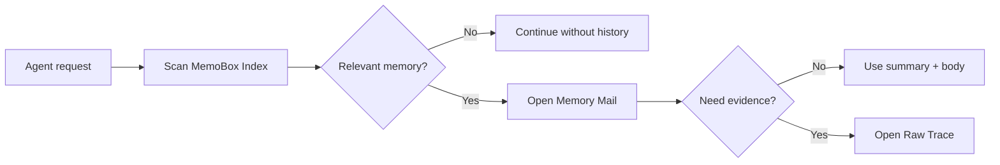

# MemoBox

> Task-level memory boxes for agents: manage long-term working memory like an inbox.

[](https://github.com/study8677/memobox/actions/workflows/ci.yml)
[](pyproject.toml)
[](LICENSE)
[](CHANGELOG.md)

[中文](README.md) | [GitHub](https://github.com/study8677/memobox)

MemoBox is a lightweight memory system prototype for AI agents. Instead of pushing every historical conversation into context, it stores each finished task as a structured "memory mail". Agents scan a lightweight index first, then expand the full body or raw trace only when needed.

## Why MemoBox

Many memory systems focus on user preferences, facts, and semantic recall. That is useful for personal assistants, but engineering agents need another kind of memory:

- Why a project was changed in a specific way.
- Which files, PRs, commands, and deployment URLs prove the result.
- Which decisions are confirmed and which risks remain open.
- How multiple agents or team roles can share task-level context.
- How to avoid scanning full conversation history at task startup.

MemoBox aims to be a working inbox and task archive for agents.

## Core Design

MemoBox has three layers:

| Layer | File | Purpose |
| --- | --- | --- |
| MemoBox Index | `index.json` | Lightweight routing/search fields: subject, summary, project, team, role, tags, status, timestamps |
| Memory Mail | `mails/<id>.json` | Expandable task memory body: context, decisions, artifacts, risks, next actions, source refs |
| Raw Trace | `traces/<id>.jsonl` | Optional raw evidence, opened only when explicitly requested |



Search reads `index.json` by default. The test suite includes a spy store that fails if search opens mail bodies or raw traces.

## Use Cases

- Long-running coding, research, or operations agents.
- Shared task context across multiple agents.
- Engineering decision records with evidence.
- Integrations with mem0, RAG, Obsidian, logs, or internal knowledge bases.
- Teams turning conversation history into maintainable knowledge assets.

## Quick Start

Install the local development package:

```bash
git clone https://github.com/study8677/memobox.git
cd memobox
python3 -m pip install -e ".[test]"
```

Initialize a MemoBox:

```bash
memobox --store .memobox init
```

Add one task memory:

```bash
memobox --store .memobox add \
  --subject "MemoBox index-first retrieval" \
  --summary "Agent should scan the lightweight index before opening memory bodies." \
  --project memobox \
  --team platform \
  --role main-agent \
  --tags memory,agent,index-first \
  --body "Implemented index/body/raw-trace split and tests for lazy expansion." \
  --decision "Search must never read raw traces by default."
```

Search the index only:

```bash
memobox --store .memobox search "index-first memory" --json
```

Open the memory body:

```bash
memobox --store .memobox show <memory-id> --json
```

Open raw trace explicitly:

```bash
memobox --store .memobox raw <memory-id> --json
```

Archive or update status:

```bash
memobox --store .memobox status <memory-id> archived
```

## Agent Read Flow

1. Extract project, path, people, time, and keyword hints from the user request.
2. Call `MemoBoxSearcher.search(...)`, which scans only the MemoBox Index.
3. Select a small number of relevant `IndexEntry` records.
4. Expand details with `JsonMemoBoxStore.open_mail(id)`.
5. Open raw evidence with `JsonMemoBoxStore.open_raw_trace(id)` only when needed.

## Python API

```python
from memobox import JsonMemoBoxStore, MemoryMail, MemoBoxSearcher

store = JsonMemoBoxStore(".memobox")
store.add_mail(
    MemoryMail(
        id="",
        subject="Agent memory design",
        summary="MemoBox stores task-level memory as index-first mail records.",
        project="memobox",
        team="platform",
        role="main-agent",
        tags=["agent-memory", "index-first"],
        context="Longer expandable body lives outside the index.",
        decisions=["Use task-level memory instead of turn-level memory for v1."],
    )
)

results = MemoBoxSearcher(store).search("agent memory", project="memobox")
mail = store.open_mail(results[0].entry.id)
```

See [docs/schema.md](docs/schema.md) for field definitions and [examples/demo.py](examples/demo.py) for a runnable example.

## Agent Integration

Most agents only need two tools:

```python
def search_memobox(query: str, project: str | None = None) -> str:
    results = MemoBoxSearcher(store).search(query, project=project, limit=3)
    return "\n".join(f"{r.entry.id}: {r.entry.summary}" for r in results)


def open_memory_mail(memory_id: str) -> str:
    mail = store.open_mail(memory_id)
    return mail.context
```

Recommended policy: call `search_memobox` at task startup, then call `open_memory_mail` only when an index summary is relevant.

## Status Model

MemoBox supports:

- `inbox`: active default memory.
- `pinned`: important memory with ranking boost.
- `needs_review`: requires human or curator-agent review.
- `archived`: hidden from default search.
- `stale`: possibly outdated and hidden from default search.

Default search includes `inbox`, `pinned`, and `needs_review`. Use `--all-statuses` to include everything.

## MemoBox and mem0

MemoBox does not try to replace mem0. They are complementary:

- mem0 is closer to a long-term preference and fact memory engine.
- MemoBox is closer to an agent work inbox and task audit archive.

A practical stack is: mem0 for semantic association and user preferences, MemoBox for task-level facts, decisions, and evidence chains.

## Roadmap

- [x] Local JSON store.
- [x] Index-first search.
- [x] CLI: `init`, `add`, `search`, `show`, `status`, `raw`.
- [x] Chinese and English README files.
- [ ] Embedding / hybrid retrieval backend.
- [ ] Memory curator agent workflow.
- [ ] SQLite / server mode.
- [ ] MCP server for Codex, Claude Desktop, Cursor, and other agent clients.
- [ ] Web UI for inbox-style memory organization.

## Development

```bash
python3 -m pip install -e ".[test]"
python3 -m pytest -q
```

The tests cover:

- Writing 10 historical tasks as one memory mail each.
- Proving search reads only the index.
- project/team/role/status filtering.
- Status persistence across index and body.
- CLI round trip: add -> search -> show -> status.

## Contributing

Issues, ideas, and PRs are welcome. Good first directions:

- Agent memory evaluation datasets.
- Integrations with mem0, MCP, and Obsidian.
- Better ranking and stale-memory policies.
- Team permission and audit models.

See [CONTRIBUTING.md](CONTRIBUTING.md).

## License

MIT License. See [LICENSE](LICENSE).
