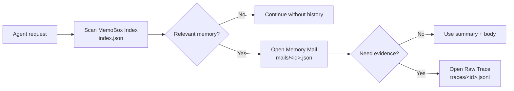

<div align="center">

# MemoBox

**Index-first task memory for AI agents.**

让 Agent 像读收件箱一样读长期记忆，而不是把历史对话整包塞进上下文。

[English](README-EN.md) · [文档结构](docs/schema.md) · [示例](examples/demo.py) · [GitHub](https://github.com/study8677/memobox)

[](https://github.com/study8677/memobox/actions/workflows/ci.yml)
[](pyproject.toml)
[](LICENSE)
[](CHANGELOG.md)

</div>

---

## MemoBox 是什么

MemoBox 是一个给 AI Agent 用的**任务级记忆盒**。它把每个完成的任务保存成一封结构化“记忆邮件”，让 Agent 下次工作时先扫轻量索引，再按需展开正文和原始证据。

它解决的是工程 Agent 最常见的长期记忆问题：

> 我们不缺历史记录，缺的是 Agent 能快速判断“哪段历史值得打开”的机制。

MemoBox 的默认策略很简单：

```text
先扫 index.json -> 命中后打开 mails/<id>.json -> 需要证据时才打开 traces/<id>.jsonl
```

第一版只专注四个承诺：

- **Index-first**：默认只搜索 `index.json`，避免把完整历史塞进上下文。
- **Task-level memory**：按一次完成任务沉淀决策、产物、风险和后续动作。
- **Evidence-aware**：需要追溯时再打开 `Memory Mail` 或 `Raw Trace`。
- **Local-first Python**：零运行时依赖，CLI + Python API，JSON 文件可审计。

## 30 秒看懂

```bash
memobox --store .memobox add \
  --subject "Fix slow /orders API" \
  --summary "Found N+1 query pattern and added eager loading." \
  --project api-platform \
  --team backend \
  --role coding-agent \
  --tags performance,n-plus-one \
  --body "Changed OrderService query path and added regression test." \
  --decision "Prefer query-level fix before introducing cache."

memobox --store .memobox search "same slow API pattern" --json
```

Agent 看到的第一层不是完整历史，而是这样的摘要索引：

```json
{
  "subject": "Fix slow /orders API",
  "summary": "Found N+1 query pattern and added eager loading.",
  "project": "api-platform",
  "tags": ["performance", "n-plus-one"],
  "status": "inbox"
}
```

只有这条摘要真的相关时，Agent 才打开任务正文或 raw trace。

## 为什么不是再做一个向量记忆库

| 常见记忆系统 | MemoBox |
| --- | --- |
| 偏用户偏好、事实片段、语义召回 | 偏任务、决策、证据、后续动作 |
| 经常直接依赖 embedding 召回 | 默认 index-first，可解释、可审计 |
| 命中后不一定知道来源 | 摘要 -> 正文 -> raw trace 可追溯 |
| 适合个人助手长期偏好 | 适合工程 Agent 和多 Agent 协作 |
| 历史越多越容易变成黑盒 | 像邮箱一样置顶、归档、标记过期 |

MemoBox 可以和 mem0、RAG、Obsidian、日志系统一起用。mem0 更适合记住用户偏好和事实，MemoBox 更适合保存 Agent 做过的工作。

## 核心能力

| 能力 | 说明 |
| --- | --- |
| Index-first retrieval | 搜索默认只读 `index.json`，不打开正文和 raw trace |
| Task memory mail | 每个任务沉淀为一封可展开记忆邮件 |
| Raw trace on demand | 原始对话、命令、工具调用只在需要证据时读取 |
| Team-ready metadata | 内置 `project`、`workspace`、`team`、`role`、`participants` |
| Inbox workflow | 支持 `inbox`、`pinned`、`needs_review`、`archived`、`stale` |
| Local-first CLI | 纯 Python、JSON 文件、易接入现有 Agent |

## 架构



MemoBox 的三层文件结构：

| 层级 | 文件 | 放什么 |
| --- | --- | --- |
| MemoBox Index | `index.json` | 标题、摘要、项目、团队、角色、标签、状态、时间 |
| Memory Mail | `mails/<id>.json` | 背景、决策、产物、风险、后续动作、来源引用 |
| Raw Trace | `traces/<id>.jsonl` | 原始对话、工具调用、终端证据或外部事件 |

测试里有 spy store 专门验证：`MemoBoxSearcher.search(...)` 不会打开正文或 raw trace。

## 快速开始

```bash
git clone https://github.com/study8677/memobox.git
cd memobox
python3 -m pip install -e ".[test]"
```

初始化：

```bash
memobox --store .memobox init
```

添加记忆：

```bash
memobox --store .memobox add \
  --subject "MemoBox index-first retrieval" \
  --summary "Agent should scan the lightweight index before opening memory bodies." \
  --project memobox \
  --team platform \
  --role main-agent \
  --tags memory,agent,index-first \
  --body "Implemented index/body/raw-trace split and tests for lazy expansion." \
  --decision "Search must never read raw traces by default."
```

检索索引：

```bash
memobox --store .memobox search "index-first memory" --json
```

展开正文：

```bash
memobox --store .memobox show <memory-id> --json
```

显式追溯 raw trace：

```bash
memobox --store .memobox raw <memory-id> --json
```

## Python API

```python
from memobox import JsonMemoBoxStore, MemoryMail, MemoBoxSearcher

store = JsonMemoBoxStore(".memobox")

store.add_mail(
    MemoryMail(
        id="",
        subject="Agent memory design",
        summary="MemoBox stores task-level memory as index-first mail records.",
        project="memobox",
        team="platform",
        role="main-agent",
        tags=["agent-memory", "index-first"],
        context="Longer expandable body lives outside the index.",
        decisions=["Use task-level memory instead of turn-level memory for v1."],
    )
)

results = MemoBoxSearcher(store).search("agent memory", project="memobox")
mail = store.open_mail(results[0].entry.id)
```

## Agent 接入方式

给 Agent 暴露两个工具就够了：

```python
def search_memobox(query: str, project: str | None = None) -> str:
    results = MemoBoxSearcher(store).search(query, project=project, limit=3)
    return "\n".join(f"{r.entry.id}: {r.entry.summary}" for r in results)


def open_memory_mail(memory_id: str) -> str:
    mail = store.open_mail(memory_id)
    return mail.context
```

推荐策略：

- 任务开始时先 `search_memobox`。
- 摘要命中后再 `open_memory_mail`。
- 只有需要证据链时才打开 raw trace。
- 任务结束时由主 Agent 或 memory curator agent 写入新的 Memory Mail。

## 适合谁

- 编码 Agent：记住项目决策、文件路径、失败原因和修复方式。
- 运维 Agent：保存事故处理、命令证据、回滚步骤。
- 研究 Agent：沉淀研究结论、来源和待验证假设。
- 多 Agent 团队：共享任务级上下文，而不是共享整段聊天记录。
- 个人知识库用户：把对话历史整理成可维护的工作档案。

## Roadmap

**Storage**

- [x] 本地 JSON store
- [ ] SQLite backend
- [ ] Schema migration

**Retrieval**

- [x] index-first lexical search
- [ ] BM25 / vector hybrid retrieval
- [ ] stale memory detection

**Agent Integration**

- [x] CLI：`init`、`add`、`search`、`show`、`status`、`raw`
- [ ] Memory curator agent workflow
- [ ] MCP server for Codex、Claude Desktop、Cursor

**UX / Trust**

- [x] 中英文 README
- [ ] Privacy redaction hooks
- [ ] Web UI：像邮箱一样整理 Agent 记忆
- [ ] Social preview and visual identity

## 开发

```bash
python3 -m pip install -e ".[test]"
python3 -m pytest -q
PYTHONPATH=src python3 examples/demo.py
```

当前测试覆盖：

- 10 个历史任务模拟写入。
- 搜索只读取索引，不打开正文或 raw trace。
- `project` / `team` / `role` / `status` 过滤。
- 状态更新同步 index 和 body。
- CLI 回归：add -> search -> show -> status。

## 测试保障

MemoBox 的核心承诺是 index-first，因此测试不只验证输出，还验证读取路径：

- `search()` 只调用 `list_index()`。
- `search()` 不调用 `open_mail()`。
- `search()` 不调用 `open_raw_trace()`。
- `show` 才展开 `Memory Mail`。
- `raw` 或显式参数才读取 `Raw Trace`。

## 贡献

MemoBox 还处在 alpha 阶段，适合参与的方向：

- Agent 记忆评测集。
- mem0 / MCP / Obsidian 集成。
- 更好的排序、过期和归档策略。
- 团队协作权限和审计模型。
- Web UI 和 social preview 设计。

详见 [CONTRIBUTING.md](CONTRIBUTING.md)。

## License

MIT License. See [LICENSE](LICENSE).
