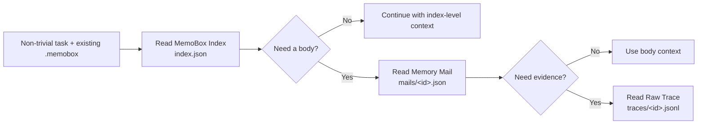

<div align="center">

# MemoBox

**A model-readable local memory file protocol for AI agents.**

给大模型看的本地优先记忆文件协议：模型直接用 Bash 读取 `index.json`、`mails/*.json` 和 `traces/*.jsonl`，CLI 只负责写入和维护一致性。

[English](README-EN.md) · [文档结构](docs/schema.md) · [Dogfood 指南](docs/dogfooding.md) · [示例](examples/demo.py) · [GitHub](https://github.com/study8677/memobox)

[](https://github.com/study8677/memobox/actions/workflows/ci.yml)
[](pyproject.toml)
[](LICENSE)
[](CHANGELOG.md)

<br/>


</div>

---

## MemoBox 是什么

MemoBox 是一个给大模型看的**本地记忆文件协议**。它把有价值的工作记录保存成结构化“记忆邮件”，并暴露轻量索引、正文和原始证据三层文件。

它解决的是工程大模型最常见的长期记忆问题：

> 我们不缺历史记录，缺的是一个模型可读、可审计、可按需展开的记忆表面。

MemoBox 的边界很简单：

```text
MemoBox 约定本地文件结构 -> 大模型直接用 Bash 读取 -> CLI 只负责写入和维护一致性
```

## 为什么是“邮箱”

邮箱模型不是比喻装饰，而是 MemoBox 的核心交互：

- **标题就是最好的摘要**：邮件标题天然要求短、明确、可扫描；Memory Mail 的 `subject` 是模型最容易读取的第一层。
- **收件箱就是轻量索引**：`index.json` 像 inbox 一样保存可扫描目录，但 MemoBox 不判断相关性。
- **正文是渐进式加载**：模型如果认为需要更多上下文，可以再打开对应 `mails/<id>.json`。
- **附件/原文是证据层**：只有需要追溯时，才打开 `traces/<id>.jsonl`。
- **状态就是记忆生命周期**：`pinned`、`archived`、`stale`、`needs_review` 对应置顶、归档、过期和待复核。

这就是 MemoBox 的渐进式读取：

```text
标题 -> 摘要 -> 正文 -> 原始证据
```

这和大模型使用 Bash/tool 的方式相吻合：文件层暴露清晰结构，模型自己决定什么时候读、读哪条、读多深。

第一版只专注五个承诺：

- **Opt-in agent loop**：已有 `.memobox` 才表示项目开启记忆闭环；非简单任务开始先读 index，结束只写高价值结果。
- **Index-first**：先暴露 `index.json` 目录，避免把完整正文和证据塞进上下文。
- **Memory mail**：用一封结构化记忆邮件沉淀决策、产物、风险和后续动作。
- **Evidence-aware**：需要追溯时再打开 `Memory Mail` 或 `Raw Trace`。
- **Local-first Python**：零运行时依赖，文件协议 + 写入/维护 CLI + Python API，JSON 文件可审计。

## 30 秒看懂

```bash
memobox --store .memobox write \
  --subject "Fix slow /orders API" \
  --summary "Found N+1 query pattern and added eager loading." \
  --project api-platform \
  --team backend \
  --role model \
  --tags performance,n-plus-one \
  --body "Changed OrderService query path and added regression test." \
  --decision "Prefer query-level fix before introducing cache."

cat .memobox/index.json
```

模型能读取的第一层不是完整历史，而是这样的目录条目：

```json
{
  "subject": "Fix slow /orders API",
  "summary": "Found N+1 query pattern and added eager loading.",
  "project": "api-platform",
  "tags": ["performance", "n-plus-one"],
  "status": "inbox"
}
```

MemoBox 不判断哪条相关。大模型自己决定是否直接打开对应正文文件或 raw trace 文件。

## 为什么不是再做一个向量记忆库

| 常见记忆系统 | MemoBox |
| --- | --- |
| 偏用户偏好、事实片段、语义召回 | 偏工作记录、决策、证据、后续动作 |
| 经常直接依赖 embedding 召回 | 默认 directory-first，可解释、可审计 |
| 来源链不一定清晰 | 摘要 -> 正文 -> raw trace 可追溯 |
| 适合个人助手长期偏好 | 适合工程大模型和多工具协作 |
| 历史越多越容易变成黑盒 | 像邮箱一样可索引、置顶、归档、标记过期 |

MemoBox 可以和 mem0、RAG、Obsidian、日志系统一起用。mem0 更适合记住用户偏好和事实，MemoBox 更适合保存模型可复查的工作记录。

## 核心能力

| 能力 | 说明 |
| --- | --- |
| File protocol first | 模型直接读取 `index.json`、`mails/*.json` 和 `traces/*.jsonl` |
| Memory mail | 每条重要记录沉淀为一封可展开记忆邮件 |
| Raw trace on demand | 原始对话、命令、工具调用只在需要证据时读取 |
| Team-ready metadata | 内置 `project`、`workspace`、`team`、`role`、`participants` |
| Memory maintenance | 支持 `pinned`、`needs_review`、`archived`、`stale` |
| Maintenance CLI | 纯 Python CLI 负责写入、状态同步、提升、合并、校验和索引重建 |

## 架构



MemoBox 的三层文件结构：

| 层级 | 文件 | 放什么 |
| --- | --- | --- |
| MemoBox Index | `index.json` | 标题、摘要、项目、团队、角色、标签、状态、时间 |
| Memory Mail | `mails/<id>.json` | 背景、决策、产物、风险、后续动作、来源引用 |
| Raw Trace | `traces/<id>.jsonl` | 原始对话、工具调用、终端证据或外部事件 |

测试会验证：`index.json` 只保存 index 层信息，不会混入正文或 raw trace。

## 快速开始

优先把 CLI 安装成隔离的用户级工具：

```bash
uv tool install "git+https://github.com/study8677/memobox.git"

# 或者
pipx install "git+https://github.com/study8677/memobox.git"

memobox --help
```

初始化：

```bash
memobox --store .memobox init
```

添加记忆：

```bash
memobox --store .memobox write \
  --subject "MemoBox index-first storage" \
  --summary "Models can read the lightweight index before opening memory bodies." \
  --project memobox \
  --team platform \
  --role model \
  --tags memory,storage,index-first \
  --body "Implemented index/body/raw-trace split and tests for lazy expansion." \
  --decision "Directory reads must never open raw traces by default."
```

直接读取记忆索引：

```bash
cat .memobox/index.json
```

按 id 直接读取正文：

```bash
cat .memobox/mails/<memory-id>.json
```

按 id 直接读取 raw trace：

```bash
cat .memobox/traces/<memory-id>.jsonl
```

## Agent 使用闭环

`.memobox` 是项目主动开启 MemoBox 的信号。安装 CLI 或插件不会让 Agent 在所有仓库自动创建 store；目录不存在时继续正常完成任务，只有用户明确选择使用时才运行 `memobox --store .memobox init`。

对于已开启 MemoBox 的项目，Agent 遵守这个闭环：

1. 简单查询、格式调整、一次性机械操作直接跳过。安全受限或包含敏感信息的任务也跳过，除非用户明确允许安全、脱敏的持久化。
2. 非简单任务开始先读取 `.memobox/index.json`，再由模型根据标题、摘要、标签、状态和时间选择是否打开具体正文。MemoBox 不排序、不筛选，也不判断相关性。
3. 只有需要证据时才读取 `traces/<id>.jsonl`。区分“打开过的 id”和“实际复用的 id”：只有真正影响计划、决策、实现或验证的记忆才算复用。
4. 任务结束执行价值门槛。只保存稳定决策、非显而易见且已验证的根因/修复、可复用的精确证据、重要风险或跨会话交接；大多数任务应写零条或一条。
5. 新记忆如果复用了旧记忆，用 `--source-ref "memobox:<id>"` 记录每个实际复用的 id。不要为了记录复用本身而额外创建低价值记忆。

```bash
memobox --store .memobox write \
  --subject "Fix concurrent index writes" \
  --summary "Added locking and atomic replacement after reproducing lost index entries." \
  --project memobox \
  --body "Verified the failure with a concurrent write reproduction and the fix with regression tests." \
  --decision "Treat mail bodies as durable records and keep index updates consistent." \
  --artifact "file:src/memobox/store.py" \
  --source-ref "memobox:<reused-memory-id>" \
  --json
```

完整的两周 dogfood 流程、运行记录字段、指标定义和验收门槛见 [docs/dogfooding.md](docs/dogfooding.md)。

## Python API

```python
from memobox import JsonMemoBoxStore, MemoryMail

store = JsonMemoBoxStore(".memobox")

store.add_mail(
    MemoryMail(
        id="",
        subject="Memory storage design",
        summary="MemoBox stores model-readable memory as index-first mail records.",
        project="memobox",
        team="platform",
        role="model",
        tags=["memory-store", "index-first"],
        context="Longer expandable body lives outside the index.",
        decisions=["Expose storage structure and let the model decide what to read."],
    )
)

directory = store.list_index()
mail = store.open_mail(directory[0].id)
```

## File Protocol And CLI

MemoBox 暴露的是本地文件协议，不是召回编排器。大模型如果有 Bash/tool 能力，应该直接读取 JSON 文件；CLI 只负责会修改多个文件或需要保持一致性的操作。

| 文件/命令 | 作用 |
| --- | --- |
| `.memobox/index.json` | 轻量记忆目录，适合模型先扫描 |
| `.memobox/mails/<id>.json` | 单条 Memory Mail 正文 |
| `.memobox/traces/<id>.jsonl` | 可选 raw trace 证据 |
| `memobox write` | 写入一条 Memory Mail，并同步 index/body/trace |
| `memobox status <id> <status>` | 同步更新正文和 index 里的状态 |
| `memobox promote <id>` | 复制可复用记忆到全局 store |
| `memobox curate duplicates` | 查找可能重复的记忆 |
| `memobox curate merge ...` | 合并多条记忆并归档来源 |
| `memobox verify` | 只读检查正文、索引和 trace 的跨文件一致性 |
| `memobox rebuild-index` | 以有效 `mails/*.json` 为真相源原子重建派生索引 |

推荐的项目级和全局级布局：

```text
your-project/.memobox        # 当前项目记忆
~/.memobox-global            # 跨项目全局经验
```

也可以用环境变量指定全局记忆位置：

```bash
export MEMOBOX_GLOBAL_STORE="$HOME/.memobox-global"
```

直接读取当前项目索引：

```bash
cat .memobox/index.json
```

直接同时读取项目和全局索引：

```bash
cat .memobox/index.json
cat ~/.memobox-global/index.json
```

写入一条记忆：

```bash
memobox --store .memobox write \
  --subject "Improve MemoBox README positioning" \
  --summary "Reframed MemoBox as a model-readable memory file protocol instead of orchestration." \
  --project memobox \
  --team platform \
  --role model \
  --tags readme,storage,open-source \
  --body "The public surface now leads with local files for reads and CLI for writes." \
  --decision "Keep MemoBox out of relevance ranking and orchestration."
```

底层 Python API 也保持同样边界：

```python
from pathlib import Path


def list_memobox_index() -> str:
    return Path(".memobox/index.json").read_text(encoding="utf-8")


def open_memory_mail(memory_id: str) -> str:
    return Path(f".memobox/mails/{memory_id}.json").read_text(encoding="utf-8")


def open_raw_trace(memory_id: str) -> str:
    return Path(f".memobox/traces/{memory_id}.jsonl").read_text(encoding="utf-8")
```

把项目经验提升为全局经验：

```bash
memobox --store .memobox promote <memory-id> \
  --global-store ~/.memobox-global \
  --tag readme-pattern
```

整理记忆：

```bash
memobox --store .memobox curate duplicates --json
memobox --store .memobox curate merge <id-a> <id-b> \
  --subject "Merged README homepage guidance" \
  --summary "Merged duplicate README optimization memories."
memobox --store .memobox status <id> stale
memobox --store .memobox status <id> pinned
```

## Claude Code / Codex Plugin

MemoBox 第一版插件是 **skills-only plugin**：它不启动 MCP server。读取走 `.memobox` 文件协议，写入和维护走 `memobox` CLI。

先安装 CLI：

```bash
uv tool install "git+https://github.com/study8677/memobox.git"

# 或者
pipx install "git+https://github.com/study8677/memobox.git"
```

Claude Code 安装：

```bash
claude plugin marketplace add study8677/memobox
claude plugin install memobox@memobox-marketplace --scope user
```

Codex 安装：

```bash
codex plugin marketplace add study8677/memobox
codex plugin add memobox@memobox-marketplace
```

安装后可以自然语言触发：

```text
用 MemoBox 查看这个项目的记忆文件
用 MemoBox 写入一条记忆
用 MemoBox 整理重复记忆
```

也可以显式调用 skill：

```text
Claude Code: /memobox:using-memobox
Codex: $using-memobox
```

默认约定：

- 启用信号：当前仓库已存在 `.memobox`；插件不会自动初始化所有项目
- 项目记忆：当前仓库 `.memobox`
- 全局记忆：`${MEMOBOX_GLOBAL_STORE:-$HOME/.memobox-global}`
- 非简单任务开始：先读 `index.json`，模型再自行选择要打开的 `mails/<id>.json` 和证据
- 任务结束：通过价值门槛后才用 `memobox write` 写结构化结果；实际复用的 id 写入 `source_refs`
- 简单、敏感、无持久价值的任务：不读取或写入 MemoBox
- 维护：使用 `memobox status/promote/curate/verify/rebuild-index`

Codex 自动压缩上下文前，插件会通过 `PreCompact(auto)` hook 尝试写入一条 checkpoint 记忆。它只是防丢的 safety net，不能代替任务结束时的高质量结构化写入：

- 只有当前仓库已经存在 `.memobox` 时才会写入，避免在所有项目里自动创建记忆目录。
- 写入的记录默认是 `needs_review`，标签包含 `codex`、`precompact`、`context`、`checkpoint`。
- 默认只记录经过筛选的 hook 元数据、当前工作目录和 git 状态，不保存完整 payload。只有明确设置 `MEMOBOX_PRECOMPACT_INCLUDE_PAYLOAD=1` 时才会保存经过基础脱敏的 payload；即便如此，MemoBox 也不承诺获得完整 transcript。
- 对敏感或安全受限的工作，设置 `MEMOBOX_PRECOMPACT_DISABLED=1`，完全跳过本次会话的自动 checkpoint。
- 如果确实希望 hook 自动初始化缺失的 store，可以设置 `MEMOBOX_PRECOMPACT_INIT=1`。

## 适合谁

- 编码模型：复查项目决策、文件路径、失败原因和修复方式。
- 运维模型：保存事故处理、命令证据、回滚步骤。
- 研究模型：沉淀研究结论、来源和待验证假设。
- 多工具协作：共享结构化工作记录，而不是共享整段聊天记录。
- 个人知识库用户：把对话历史整理成可维护的工作档案。

## Roadmap

**Storage**

- [x] 本地 JSON store
- [x] 跨进程写锁、原子替换和可重建派生索引
- [ ] SQLite backend
- [ ] Schema migration

**Storage Interface**

- [x] index-first local file protocol
- [x] maintenance CLI：`write`、`status`、`promote`、`curate`、`verify`、`rebuild-index`
- [ ] 更好的 index 分组和生命周期视图
- [ ] stale memory detection

**Model Integration**

- [x] CLI：`init`、`write`、`status`、`promote`、`curate`
- [x] Claude Code / Codex skills-only plugin
- [x] Codex `PreCompact(auto)` checkpoint hook
- [x] `.memobox` opt-in + index-first + high-value write agent loop
- [ ] 在三个活跃项目完成 20 个真实任务的 dogfood 验证
- [ ] MCP server for Codex、Claude Desktop、Cursor

**UX / Trust**

- [x] 中英文 README
- [ ] Privacy redaction hooks
- [ ] Web UI：像邮箱一样整理模型可读记忆
- [ ] Social preview and visual identity

## 开发

```bash
python3 -m venv .venv
source .venv/bin/activate
python3 -m pip install -e ".[test]"
python3 -m pytest -q
PYTHONPATH=src python3 examples/demo.py
```

当前测试覆盖：

- 10 个历史任务模拟写入。
- 文件协议读取 `index.json`、`mails/*.json` 和 `traces/*.jsonl`。
- 已移除 `index/read/trace` 和 legacy 读取命令。
- 状态更新同步 index 和 body。
- CLI 回归：write -> direct file read -> status。
- 并发子进程写入不丢索引，损坏索引可从有效正文安全重建。

## 测试保障

MemoBox 的核心承诺是 index-first 文件协议，因此测试不只验证写入，还验证读取路径：

- `index.json` 不包含 `context`、`decisions` 或 raw trace 内容。
- `mails/<id>.json` 才包含 Memory Mail 正文。
- `traces/<id>.jsonl` 才包含 Raw Trace。
- CLI 不再包装读取命令。

## 贡献

MemoBox 还处在 alpha 阶段，适合参与的方向：

- 模型可读记忆评测集。
- mem0 / MCP / Obsidian 集成。
- 更好的 index 组织、过期和归档策略。
- 团队协作权限和审计模型。
- Web UI 和 social preview 设计。

详见 [CONTRIBUTING.md](CONTRIBUTING.md)。

## License

MIT License. See [LICENSE](LICENSE).
