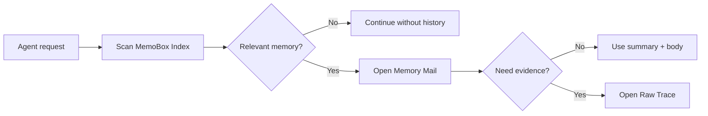

# MemoBox

> 面向 Agent 的任务级记忆盒：像整理邮箱一样管理长期工作记忆。

[](https://github.com/study8677/memobox/actions/workflows/ci.yml)
[](pyproject.toml)
[](LICENSE)
[](CHANGELOG.md)

[English](README-EN.md) | [GitHub](https://github.com/study8677/memobox)

MemoBox 是一个轻量的 Agent 记忆系统原型。它不把所有历史对话都塞进上下文，而是把每个完成的任务沉淀成一封结构化“记忆邮件”。Agent 下一次开始工作时，先扫描轻量索引，再按需展开正文或原始 trace。

## 为什么需要 MemoBox

很多 Agent 记忆方案偏向“记住用户偏好”和“语义召回历史片段”。这对个人助手很有用，但工程 Agent 还需要另一类记忆：

- 上次某个项目为什么这样改。
- 哪些文件、PR、命令和部署地址是证据。
- 哪些结论已经确认，哪些风险还没关闭。
- 多个 Agent 或团队角色如何共享任务级上下文。
- 如何避免每次任务启动都扫描整段历史。

MemoBox 的目标是成为 Agent 的工作邮箱和任务档案系统。

## 核心设计

MemoBox 使用三层结构：

| 层级 | 文件 | 作用 |
| --- | --- | --- |
| MemoBox Index | `index.json` | 轻量索引，只包含标题、摘要、项目、团队、角色、标签、状态、时间等字段 |
| Memory Mail | `mails/<id>.json` | 任务记忆正文，包含背景、决策、产物、风险、后续动作和来源引用 |
| Raw Trace | `traces/<id>.jsonl` | 可选原始记录，只在需要追溯证据时显式打开 |



默认检索只读取 `index.json`。测试里有专门的 spy store 保证 search 不会偷偷打开正文或 raw trace。

## 适合场景

- 长期运行的编码 Agent、研究 Agent、运维 Agent。
- 多 Agent 协作时共享任务级上下文。
- 需要审计证据的工程决策记录。
- 对接现有记忆系统，例如 mem0、RAG、Obsidian、日志系统。
- 想把“对话历史”整理成可维护知识资产的团队。

## 快速开始

安装本地开发版本：

```bash
git clone https://github.com/study8677/memobox.git
cd memobox
python3 -m pip install -e ".[test]"
```

初始化一个 MemoBox：

```bash
memobox --store .memobox init
```

添加一封任务记忆：

```bash
memobox --store .memobox add \
  --subject "MemoBox index-first retrieval" \
  --summary "Agent should scan the lightweight index before opening memory bodies." \
  --project memobox \
  --team platform \
  --role main-agent \
  --tags memory,agent,index-first \
  --body "Implemented index/body/raw-trace split and tests for lazy expansion." \
  --decision "Search must never read raw traces by default."
```

只搜索索引：

```bash
memobox --store .memobox search "index-first memory" --json
```

展开正文：

```bash
memobox --store .memobox show <memory-id> --json
```

显式查看原始 trace：

```bash
memobox --store .memobox raw <memory-id> --json
```

归档或标记状态：

```bash
memobox --store .memobox status <memory-id> archived
```

## Agent 读取流程

1. 从用户请求里提取项目、路径、人物、时间和关键词。
2. 调用 `MemoBoxSearcher.search(...)`，只扫描 MemoBox Index。
3. 选择少量相关 `IndexEntry`。
4. 通过 `JsonMemoBoxStore.open_mail(id)` 展开正文。
5. 只有证据不足时，才调用 `JsonMemoBoxStore.open_raw_trace(id)`。

## Python API

```python
from memobox import JsonMemoBoxStore, MemoryMail, MemoBoxSearcher

store = JsonMemoBoxStore(".memobox")
store.add_mail(
    MemoryMail(
        id="",
        subject="Agent memory design",
        summary="MemoBox stores task-level memory as index-first mail records.",
        project="memobox",
        team="platform",
        role="main-agent",
        tags=["agent-memory", "index-first"],
        context="Longer expandable body lives outside the index.",
        decisions=["Use task-level memory instead of turn-level memory for v1."],
    )
)

results = MemoBoxSearcher(store).search("agent memory", project="memobox")
mail = store.open_mail(results[0].entry.id)
```

更多字段定义见 [docs/schema.md](docs/schema.md)。可运行示例见 [examples/demo.py](examples/demo.py)。

## Agent 集成

把 MemoBox 接入一个 Agent 通常只需要两个工具：

```python
def search_memobox(query: str, project: str | None = None) -> str:
    results = MemoBoxSearcher(store).search(query, project=project, limit=3)
    return "\n".join(f"{r.entry.id}: {r.entry.summary}" for r in results)


def open_memory_mail(memory_id: str) -> str:
    mail = store.open_mail(memory_id)
    return mail.context
```

推荐策略：Agent 启动任务时先调用 `search_memobox`，只有摘要命中且确实相关时再调用 `open_memory_mail`。

## 状态模型

MemoBox 支持以下状态：

- `inbox`：默认活跃记忆。
- `pinned`：重要记忆，排序时加权。
- `needs_review`：需要人或 curator agent 复核。
- `archived`：默认搜索不返回。
- `stale`：可能过期，默认搜索不返回。

默认搜索包含 `inbox`、`pinned`、`needs_review`。如果需要纳入全部状态，使用 `--all-statuses`。

## 和 mem0 的关系

MemoBox 不试图替代 mem0。二者更适合组合：

- mem0 更像“长期偏好和事实记忆引擎”。
- MemoBox 更像“Agent 工作邮箱和任务审计档案”。

一个实用组合是：mem0 做语义联想和用户偏好，MemoBox 做任务级事实、决策和证据链。

## 路线图

- [x] 本地 JSON store。
- [x] index-first search。
- [x] CLI：`init`、`add`、`search`、`show`、`status`、`raw`。
- [x] 中英文 README。
- [ ] Embedding / hybrid retrieval backend。
- [ ] Memory curator agent workflow。
- [ ] SQLite / server mode。
- [ ] MCP server for Codex、Claude Desktop、Cursor 等 Agent 客户端。
- [ ] Web UI：像邮箱一样整理记忆。

## 开发

```bash
python3 -m pip install -e ".[test]"
python3 -m pytest -q
```

当前测试覆盖：

- 10 个历史任务模拟写入。
- 搜索只读取索引，不打开正文或 raw trace。
- project/team/role/status 过滤。
- 状态更新同步 index 和 body。
- CLI 完整回归：add -> search -> show -> status。

## 贡献

欢迎提交 issue、idea 和 PR。适合优先参与的方向：

- Agent 记忆评测集。
- MemoBox 与 mem0 / MCP / Obsidian 的集成。
- 更好的检索排序和过期策略。
- 团队协作权限和审计模型。

详见 [CONTRIBUTING.md](CONTRIBUTING.md)。

## License

MIT License. See [LICENSE](LICENSE).
